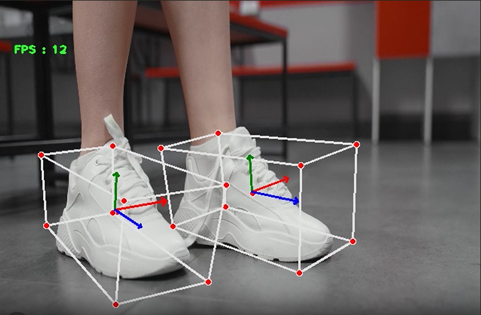
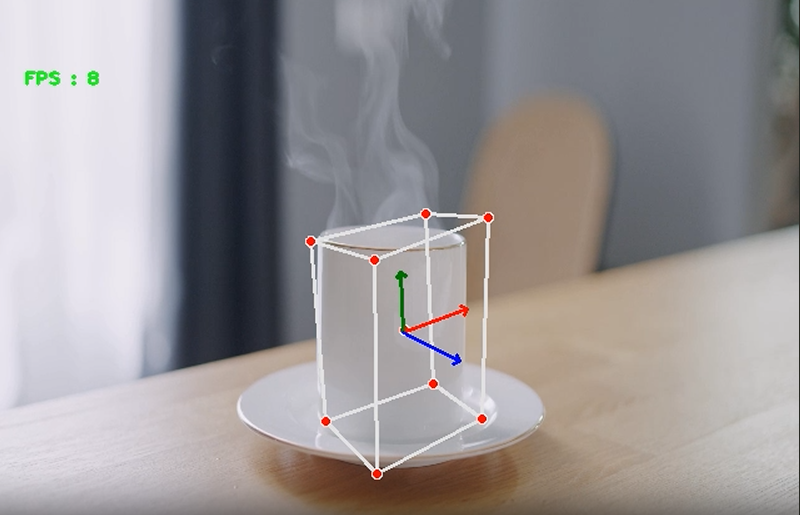

# 3D Small Object Detection using Objectron

A computer vision project for detecting small objects and estimating their 3D pose using Google's Objectron framework. This system processes real-time video input and generates 3D bounding boxes around detected objects.

---

## 🚀 Features
- 🔍 Real-time object detection  
- 📐 3D bounding box estimation  
- 🎯 Object pose & orientation tracking  
- 📷 Webcam / video input support  
- 💾 Save processed output videos (MP4 with timestamp)  

---

## 🧠 Tech Stack
- Python  
- OpenCV  
- MediaPipe Objectron  
- NumPy  

---

## 📂 Updated Project Structure

```
3D-ObjectDetection/
│
├── src/
│   ├── objectdetection.py     # Main detection script
│   └── outputs/               # Saved output videos
│       ├── result_20260416_164153.mp4
│       ├── result_20260416_164233.mp4
│
├── test-resources/            # Sample test videos
│   ├── cup.mp4
│   ├── shoe1.mp4
│   └── shoe2.mp4
│
└── README.md
```

---

## ⚙️ Installation

```bash
git clone https://github.com/hereiamsheel/objectron-3d-detection.git
cd objectron-3d-detection
```

```bash
python -m venv venv
venv\Scripts\activate        # Windows
# or
source venv/bin/activate     # Linux/Mac
```

```bash
pip install opencv-python mediapipe numpy
```

---

## ▶️ Usage

```bash
python src/objectdetection.py
```

---

## 💾 Output

[](src/outputs/result_20260416_164153.mp4)
[](src/outputs/result_20260416_164233.mp4)

---

## 🧪 Workflow
1. Capture frames from webcam or video  
2. Process frames using Objectron  
3. Detect object keypoints  
4. Estimate 3D bounding box  
5. Save annotated output video  

---

## 📌 Requirements

```
opencv-python
mediapipe
numpy
```

---

## 🔧 Customization
- Change object type (Shoe, Cup, Chair, Camera)  
- Adjust detection confidence  
- Use test videos from `test-resources/`  

---

## ⚠️ Limitations
- Works only with supported Objectron models  
- Sensitive to lighting and occlusion  
- Less accurate for very small objects  

---

## 🙌 Acknowledgements
- Google MediaPipe Objectron  
- OpenCV Community  

---

⭐ Star this repo if you found it useful!
